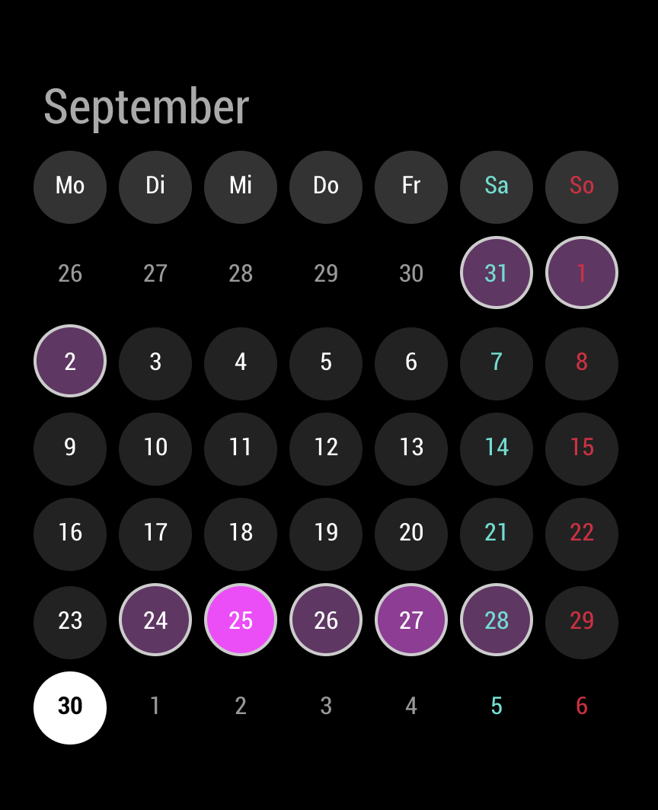

# MMM-CalendarExtMiniMonth

Mini month plugin for the default `calendar` module and [MMM-CalendarExt2](https://github.com/MagicMirrorModules/MMM-CalendarExt2).

## Screenshot



## Installation

This module works with the default `calendar` module or [MMM-CalendarExt2](https://github.com/MagicMirrorModules/MMM-CalendarExt2).

```sh
cd ~/MagicMirror/modules
git clone https://github.com/MagicMirrorModules/MMM-CalendarExtMiniMonth
```

## Update

```sh
cd ~/MagicMirror/modules/MMM-CalendarExtMiniMonth
git pull
```

## Configuration

Basic example:

```js
{
  module:"MMM-CalendarExtMiniMonth",
  position:"top_left",
},
```

### Defaults & Details

These values are defined as default. You don't need to copy entire things. Just select what you need.

```js
defaults: {
  locale: null,
  // if null, locale of system default will be used.
  // e.g) "en-US", "de-DE", "ko-KR", ...

  dynamicEventColor: ["#333", "#F3F"],
  // if null, only circle border will be shown when event exists.
  // You can use color name or rgb(), rgba() CSS functions.
  // e.g) ["LightRed", "DarkBlue"]

  maxItems: 100,
  // if you need, give enough counts. This value would be related with performance.

  refreshInterval: 60*10*1000,
  // milliseconds. Do you really need

  titleFormat: "MMMM",
  // supported values: "MMMM", "MMM", "D", "DD", "Do", "dd", "ddd", "dddd"

  weekdayFormat: "dd",
  //"dd", "ddd", "dddd",

  dateFormat: "D",
  //D, Do, DD.

  // I believe it's better to leave `weekdayFormat` and `dateFormat` as current values.

  calendars: [], // names of calendar in your default calendar/MMM-CalendarExt2
  // Use when you need only specific calendars.

  source: "CALENDAR",
  // or "CALEXT2"
},
```

When using the default `calendar` module, make sure its config enables `broadcastEvents: true`.

## Styling

See MMM-CalendarExtMiniMonth.css
